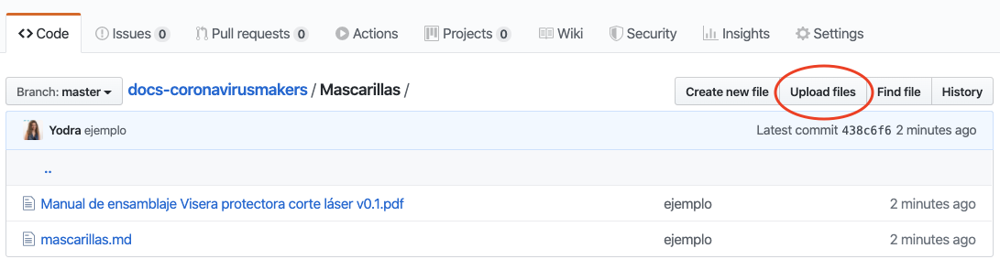

# docs-coronavirusmakers
Documentación centralizada de coronavirus makers

## Como añadir documentación
El repositorio esta organizado por objetos. Solo tienes que añadir en la carpeta correspondiente el manual 
y darlo de alta en el documento `.md` que encontraras en la misma carpeta. 

### Subir fichero
Accede a la carpeta del tipo de objeto que quieres subir y has click en el `upload files`

En la siguiente pantalla selecciona el/los ficheros, escribe un mensaje y pulsa `commit changes`

....

### Actualizar inventario
En la carpeta del objeto encontraras un fichero llamado `00-nombreDelObjeto.md` añade en el la información al 
respecto de los documentos que has adjuntado.
